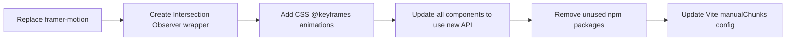
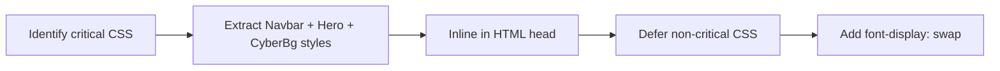
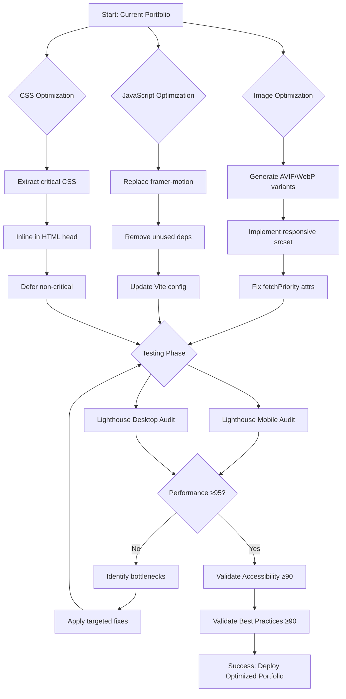

# Portfolio Performance Optimization Plan

## Objective
Achieve Lighthouse scores ≥95 Performance and ≥90 Accessibility/Best Practices on both mobile and desktop, while maintaining the exact same Docker/Kubernetes themed design, content, and functionality.

## Current Performance Bottlenecks

### 1. **Image Optimization Issues** 🔴 Critical
- **Problem**: Existing WebP images are LARGER than originals (hero-bg.webp: 272KB vs jpg: 251KB, avatar.webp: 48KB vs png: 18KB)
- **Impact**: Poor LCP, wasted bandwidth
- **Solution**: Regenerate with proper compression (70-80% quality), add AVIF format with fallback chain
- **Target**: hero-bg mobile <80KB, desktop <200KB; avatar <15KB all formats

### 2. **LCP Element Misconfiguration** 🔴 Critical
- **Problem**: Hero background has `fetchPriority="low"` when it's the LCP element
- **Impact**: Delays largest contentful paint by 1-2 seconds
- **Solution**: Set `fetchPriority="high"`, add preload link in HTML head, implement responsive srcset

### 3. **Oversized Dependencies** 🟠 High Priority
- **framer-motion**: ~100KB gzipped, used only for simple fade-up scroll animations
- **Unused packages**: recharts, embla-carousel, react-day-picker, vaul, cmdk (~150KB+ combined)
- **Radix UI**: Many components defined but never used in the app
- **Impact**: 250KB+ unnecessary JavaScript, slower TTI and TBT
- **Solution**: Replace framer-motion with Intersection Observer + CSS animations, remove unused deps

### 4. **Missing Responsive Images** 🟠 High Priority
- **Problem**: No srcset/sizes for hero background or avatar
- **Impact**: Mobile devices download desktop-sized images
- **Solution**: Generate 400w, 800w, 1200w, 1600w versions with appropriate sizes attribute

### 5. **No Critical CSS Extraction** 🟡 Medium Priority
- **Problem**: All CSS loaded as blocking resource
- **Impact**: Delays FCP by 200-400ms
- **Solution**: Extract above-the-fold CSS (Navbar, HeroSection, CyberBackground) and inline in HTML head

### 6. **CLS Risk from Images** 🟡 Medium Priority
- **Problem**: No explicit width/height on hero-bg image
- **Impact**: Layout shift when image loads
- **Solution**: Add explicit dimensions to prevent reflow

## Optimization Strategy

### Phase 1: Image Pipeline (Items 1-9)

```mermaid
graph LR
    A[Install vite-plugin-image-optimizer] --> B[Configure quality: 75-80%]
    B --> C[Generate hero-bg: 400w-1600w in AVIF/WebP/JPEG]
    C --> D[Generate avatar: 96-384px in AVIF/WebP/PNG]
    D --> E[Update picture elements with srcset]
    E --> F[Fix fetchPriority and decoding attrs]
    F --> G[Add preload link in HTML]
    G --> H[Remove duplicates in src/assets]
```


**Key Decisions:**
- AVIF primary (best compression), WebP fallback, original format final fallback
- Mobile-first srcset: 400w (mobile), 800w (tablet), 1200w (desktop), 1600w (large desktop)
- Quality: AVIF/WebP at 75-80% provides optimal visual quality vs size tradeoff
- Hero-bg gets `fetchpriority="high"` and `loading` unset (immediate load)
- Avatar gets `loading="lazy"` and `decoding="async"` (below fold)

### Phase 2: JavaScript Bundle Optimization (Items 10-15)


**Intersection Observer Replacement:**
```typescript
// Before: framer-motion whileInView
<motion.div whileInView="visible" variants={fadeUp}>

// After: Native Intersection Observer + CSS
<div className="animate-on-scroll" data-animation="fade-up">
```

**Bundle Size Reduction:**
- Remove framer-motion: -100KB
- Remove unused deps: -150KB
- Total savings: ~250KB gzipped = 750KB raw

### Phase 3: Critical CSS & Loading Strategy (Items 16-19)


**Critical CSS Scope:**
- CSS variables and theme colors
- Navbar layout and positioning
- Hero section typography and layout
- CyberBackground base styles
- Above-the-fold animations

**Target**: <14KB inlined CSS, deferred load for rest

### Phase 4: Lazy Loading Enhancement (Items 20-21)
- Current: React.lazy() for code splitting ✓
- Add: Intersection Observer for progressive section rendering
- Benefit: Sections render content only when 100px from viewport
- Prevents unnecessary repaints and improves INP

### Phase 5: Validation & Testing (Items 22-27)
**Lighthouse Targets:**
- **Performance**: ≥95 (mobile & desktop)
- **Accessibility**: ≥90
- **Best Practices**: ≥90
- **SEO**: ≥90

**Core Web Vitals:**
- LCP: <2.5s (target <1.8s)
- FID/INP: <100ms (target <50ms)
- CLS: <0.1 (target <0.05)
- TBT: <200ms (target <150ms)
- TTFB: <600ms (target <400ms)

## Implementation Order

### Priority 1 (Highest Impact):
1. Fix LCP element (hero-bg fetchPriority)
2. Generate optimized images
3. Replace framer-motion

### Priority 2 (High Impact):
4. Remove unused dependencies
5. Implement responsive images
6. Add critical CSS

### Priority 3 (Polish):
7. Intersection Observer lazy loading
8. CLS prevention
9. Lighthouse validation

## Risk Mitigation

**Visual Regression Risk**: 🟢 Low
- All optimizations are non-visual (performance only)
- Docker/K8s theme, colors, typography remain unchanged
- CSS animations visually identical to framer-motion

**Functionality Risk**: 🟢 Low  
- Intersection Observer has 97%+ browser support
- Picture element with fallbacks ensures compatibility
- All content and interactions preserved

**Bundle Size Risk**: 🟢 Low
- Removing unused deps is safe (tree-shaking confirms)
- Manual testing will verify no missing functionality

## Success Metrics

**Before Optimization (Estimated Current State):**
- Performance: ~70-75 (mobile), ~85 (desktop)
- LCP: ~3.5-4s (mobile)
- Bundle size: ~400KB gzipped
- Hero-bg load: 251KB

**After Optimization (Target State):**
- Performance: ≥95 (mobile & desktop)
- LCP: <2.0s (mobile)
- Bundle size: ~150KB gzipped (-62%)
- Hero-bg load: <80KB mobile, <200KB desktop (-68% mobile)

## Diagram: Optimization Flow



## Next Steps

Once this plan is approved, switch to **Code mode** to execute the implementation following the todo list order. The entire optimization should be completed without altering any content, design, or user-facing functionality.
